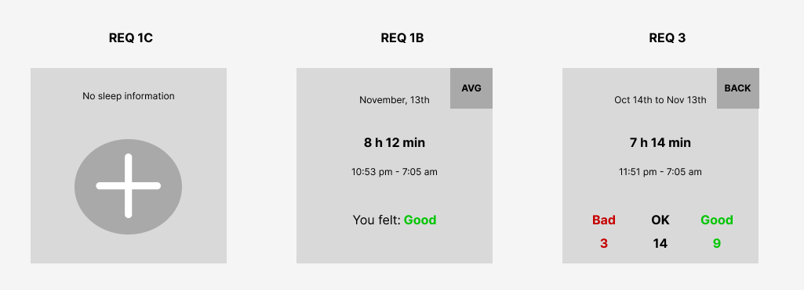

# My notes
- this component looks like widget - so i didn't add any routes
- also i didn't use any state manager in order to save time
- there was i fight with linter so i disabled a few rules
- didn't spend any time on styles, styles that i created all in one file, usually i put it next to index file that they belong to
- a lot of "any"s just to save time, usually don't write it in such quantities 
- there is an inconsistency in BE field names, but this the first time i write python BE so decided not to spend any additional time to prettify it
- didn't spend time on form creation - date picker and normal validation rules 
- overall this test took 10+- hours, half of this is BE and env set up

# Frontend Engineering Interview: Take-home Assignment

Hello!

This is the repository that contains everything you need to complete the take home assignment, a part of the front end engineer interview process for Noom.

## The Assignment

You need to develop a sleep logger that will later be integrated into the Noom web interface. The functional requirements are:

 1. Display information about the last night's sleep
    1. This is the first screen that should be shown on the open
    1. In case there is data for last night's sleep, show
        1. The date of the sleep (today)
        1. The time in bed interval
        1. Total time in bed
        1. How the user felt in the morning
    1. If there is no data, show a caption saying there's no data and a button that gets the user to a form to enter the sleep data (goes to requirement #2)
    1. Include a button to switch to average view (goes to requirement #3)
 1. Allow the user to log sleep information for the last night.
    1. The information that the user needs to enter is:
        1. Time the user went to bed
        1. Time the user got up
        1. How the user felt in the morning (one of Bad, OK, Good) (optional)
    1. The user can save, in which case the user goes to the 1.ii case
    1. The user can cancel, in which case they go to case the 1.iii case
 1. Display the last 30-day averages
    1. Data to show
        1. The range for which averages are shown
        1. Average total time in bed
        1. The average time the user gets to bed and gets out of bed
        1. Frequencies of how the user felt in the morning
    1. The user can switch back to the single sleep log view (goes to requirement #1)

Sample wireframes supporting the requirements

The assignment is to:

 1. Build a React view that will use the REST API service. Integrate it into a one-page web app so that it is demo-able.
 1. Implement backend logic that will calculate the averages needed for the requirement (3).

## Instructions

 1. Fork the repository
    1. The forked repository should be private and shared with GitHub user your recruiter shared in the initial email. 
 1. All code changes should be merged in as PRs to the new repository.
 1. Write code and PR descriptions as if you were writing production-level code.
 1. The template in this repository provides a basic environment. Everything needed to start and test your code is available and functional. We expect you to use React and Python/Django. If you want to add new frameworks on top of that, you are free to do so.
 1. Keep in mind the goal of the interview is to assess your software development and coding skills:
    1. Don't waste time on polishing the looks/UI of the app. Since only basic wireframes are provided, we do not expect high-quality design.
    1. Don't waste time tweaking the configuration of the server, the DB, or the build system. The defaults in use here are good enough for this exercise.

## How to Run

Dockerfiles are set up for your convenience for running the whole project. You will need docker and ports 5432 (Postgres), 8000 (API), and 3000 (client) available.

To run everything, simply execute `docker-compose up`. To build and run, execute `docker-compose up --build`.
